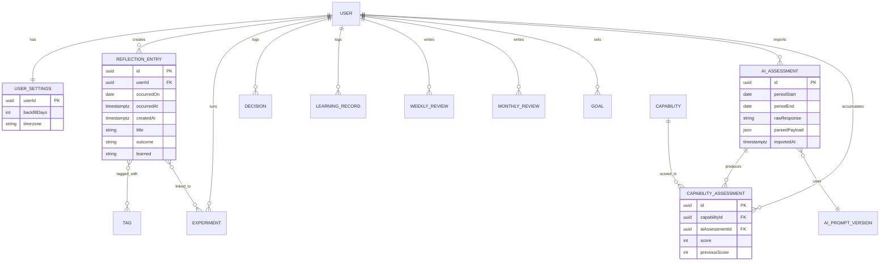

# Personal Capability OS — Engineering Plan
**For: AI coding agents implementing the build**
**Source of truth: `Personal_Capability_OS_Engineering_Handoff_PRD_v2` (v2, Sept 2026)**
**Status: Ready for implementation**

---

## How to use this document

This is not a summary of the PRD. It is a concrete, opinionated engineering plan that
resolves every open decision the PRD left to "engineering." Agents implementing this
should treat every section as authoritative unless it visibly conflicts with a
**Non-Negotiable Constraint** from the PRD (§31), in which case the PRD wins and the
conflict should be flagged back to the human.

Build order follows §13 (Phased Implementation). Do not skip ahead to AI import or
reviews before the core date/entry/backfill model (Phase 1) is fully tested — it is the
foundation everything else depends on.

---

## 1. Stack Decision & Justification

| Layer | Choice | Why |
|---|---|---|
| Language | TypeScript (strict mode) end-to-end | Single language across frontend/backend/scripts reduces context-switching for a solo-maintained app; strong typing catches date/timezone bugs (the app's highest-risk area) at compile time. |
| Backend framework | **Node.js + Express** (or Fastify) as a REST API | PRD explicitly wants a simple REST surface (§25) and "avoid microservices and unnecessary infrastructure" (§31). A single deployable API service satisfies this directly. |
| Frontend framework | **Next.js 14+ (App Router), React, TypeScript** | Server-side rendering for a fast mobile capture flow (§27 mobile requirement), file-based routing matches the route list in §7, easy to co-locate with the API on the same host to minimize infra. |
| Database | **PostgreSQL 15+** | PRD names Postgres explicitly (§30.3). Native `DATE` vs `TIMESTAMPTZ` types map directly onto the `occurred_on` / `occurred_at` / `created_at` distinction that is the core invariant of this app (§4, §13). |
| ORM | **Prisma** | Type-safe schema-to-code, first-class migrations, works well with an AI agent workflow because schema changes are declarative and diffable. |
| Auth | **Custom single-user auth** using `argon2` password hashing + signed HTTP-only session cookie (`iron-session` or equivalent) | This is explicitly a single-user private app (§27, §30.5) — no need for OAuth, multi-tenant roles, or a third-party auth provider. Keep the surface area small. |
| Styling | Tailwind CSS | Fast to build a clean mobile-first capture UI without a design system overhead. |
| State management | React Server Components + minimal client state (React Query for client-side fetching/mutations where needed) | Avoids a heavy global state library for what is fundamentally a CRUD app. |
| Hosting | **Single VM or a low-cost PaaS (Railway / Render / Fly.io)** running the Next.js app + a managed Postgres instance (Railway/Render/Neon) | Satisfies §29 "inexpensive deployment" and §31 "avoid microservices." One app, one database, one deploy target. |
| Testing | Vitest (unit/integration), Playwright (E2E) | Fast TS-native unit testing; Playwright covers the mobile capture flow and backfill boundary E2E cases required by §30.18. |
| Validation | Zod | Used for both API payload validation and validating the pasted AI JSON response against the schema in §20 — one validation library end-to-end. |
| Timezone handling | `date-fns-tz` (or `Temporal` polyfill if stable) | The single most bug-prone part of this app (§24, §26) — needs a dedicated, tested date utility module, not ad hoc `Date` math. |

**Rejected alternatives and why:**
- *Microservices*: explicitly forbidden by §31. One monolith service is correct at this scale.
- *Firebase/Supabase as the whole backend*: viable but the AI-import validation logic and backfill rules are complex enough that owning a real Postgres schema with proper constraints (§13) is safer than working around a BaaS's query limitations.
- *Built-in AI API integration*: explicitly out of scope for MVP (§18, §29, §31). Do not implement server-side calls to any LLM provider in MVP. The workflow is copy-out / paste-in only.

---

## 2. Repository Structure

Single repo, two workspaces (or a single Next.js app with an `/app/api` route handler
layer — either is acceptable; the plan below assumes a **separate API service** for
clearer module boundaries, since the PRD calls out explicit endpoint design in §25).

```
personal-capability-os/
├── apps/
│   ├── web/                      # Next.js frontend
│   │   ├── app/
│   │   │   ├── (auth)/login/
│   │   │   ├── (main)/
│   │   │   │   ├── page.tsx              # Today / dashboard
│   │   │   │   ├── calendar/page.tsx
│   │   │   │   ├── timeline/page.tsx
│   │   │   │   ├── entries/[id]/page.tsx
│   │   │   │   ├── entries/new/page.tsx
│   │   │   │   ├── experiments/
│   │   │   │   ├── decisions/
│   │   │   │   ├── learning-records/
│   │   │   │   ├── reviews/weekly/
│   │   │   │   ├── reviews/monthly/
│   │   │   │   ├── ai-review/page.tsx        # Prepare AI Review Package
│   │   │   │   ├── ai-import/page.tsx        # Paste + validate + import
│   │   │   │   ├── capabilities/page.tsx
│   │   │   │   ├── search/page.tsx
│   │   │   │   └── settings/page.tsx
│   │   │   └── layout.tsx
│   │   ├── components/
│   │   │   ├── capture/         # RecordSomethingForm, DatePicker w/ backfill window
│   │   │   ├── calendar/        # CalendarGrid, DateCell (entry-present indicator)
│   │   │   ├── dashboard/       # CapabilityStateCard, BottleneckCard
│   │   │   ├── review/          # WeeklyReviewForm, MonthlyReviewForm
│   │   │   ├── ai/              # ReviewPackagePreview, AssessmentImportPreview
│   │   │   └── ui/              # shared primitives
│   │   ├── lib/
│   │   │   ├── api-client.ts    # typed fetch wrapper to apps/api
│   │   │   └── date-utils.ts    # client-side mirror of backend backfill window calc (display only, never authoritative)
│   │   └── ...
│   └── api/                      # Express/Fastify REST API
│       ├── src/
│       │   ├── modules/
│       │   │   ├── auth/
│       │   │   ├── settings/
│       │   │   ├── entries/
│       │   │   ├── experiments/
│       │   │   ├── decisions/
│       │   │   ├── learning-records/
│       │   │   ├── reviews/
│       │   │   ├── capabilities/
│       │   │   ├── ai/          # review-package builder, validate, import
│       │   │   ├── search/
│       │   │   └── export/
│       │   ├── lib/
│       │   │   ├── date.ts      # CANONICAL date/timezone/backfill utility — single source of truth (§26)
│       │   │   ├── auth-middleware.ts
│       │   │   └── errors.ts
│       │   ├── db/
│       │   │   ├── prisma/schema.prisma
│       │   │   └── migrations/
│       │   └── server.ts
│       └── test/
│           ├── unit/
│           ├── integration/
│           └── e2e/            # Playwright, run against apps/web + apps/api together
├── packages/
│   └── shared-types/            # Zod schemas + TS types shared by web and api (entry payloads, AI JSON schema, capability taxonomy)
├── docs/
│   └── (this plan, ADRs)
├── docker-compose.yml            # local Postgres for dev
├── package.json                  # workspace root (npm/pnpm workspaces)
└── README.md
```

**Module boundary rule:** `apps/api/src/lib/date.ts` is the *only* place backfill-window
math and timezone conversion may be implemented. Every other module imports from it.
This directly satisfies §26's requirement for "one canonical date utility throughout the
application" and is the single highest-priority code-review rule for this project.

---

## 3. Database Schema (PostgreSQL, via Prisma)

### 3.1 Design principles enforced in schema

- No unique constraint on `(user_id, occurred_on)` anywhere (§13).
- `occurred_on` (DATE) and `created_at` (TIMESTAMPTZ) are always separate columns, never derived from one another.
- No table for "daily reflection" — entries are independent rows keyed by their own id (§8, §9).
- `ai_assessments` and `capability_assessments` are **append-only**: no UPDATE or DELETE endpoints will ever be exposed for these tables (§13, §21).
- All user-owned tables carry `user_id` and every query is scoped to the authenticated user (§13) — enforced in MVP by the fact there is exactly one user row, but the column and scoping logic are still implemented for future-proofing and to keep the failure mode of "wrong data returned" impossible even with one user.

### 3.2 Prisma schema

```prisma
// schema.prisma

generator client {
  provider = "prisma-client-js"
}

datasource db {
  provider = "postgresql"
  url      = env("DATABASE_URL")
}

model User {
  id            String   @id @default(uuid())
  email         String   @unique
  passwordHash  String
  createdAt     DateTime @default(now())

  settings              UserSettings?
  reflectionEntries     ReflectionEntry[]
  experiments           Experiment[]
  decisions             Decision[]
  learningRecords       LearningRecord[]
  weeklyReviews         WeeklyReview[]
  monthlyReviews        MonthlyReview[]
  goals                 Goal[]
  aiAssessments         AIAssessment[]
  capabilityAssessments CapabilityAssessment[]
}

model UserSettings {
  userId          String   @id
  user            User     @relation(fields: [userId], references: [id])
  backfillDays    Int      @default(7)   // MVP min 0, max enforced in app layer (365)
  timezone        String   @default("Asia/Kolkata")
  createdAt       DateTime @default(now())
  updatedAt       DateTime @updatedAt

  @@check(backfillDays >= 0)
}

model ReflectionEntry {
  id            String    @id @default(uuid())
  userId        String
  user          User      @relation(fields: [userId], references: [id])

  occurredOn    DateTime  @db.Date          // the day the event happened — NEVER derived from createdAt
  occurredAt    DateTime? @db.Timestamptz   // optional precise time of event
  createdAt     DateTime  @default(now()) @db.Timestamptz
  updatedAt     DateTime  @updatedAt

  title         String?
  intent        String?   // "What did I try to accomplish?"
  outcome       String?   // "What actually happened?"
  wentWell      String?
  struggle      String?
  whyItHappened String?
  learned       String?
  willChange    String?
  notes         String?

  tags          EntryTag[]
  experimentLinks ExperimentEntryLink[]

  @@index([userId, occurredOn])
  // Deliberately NO @@unique([userId, occurredOn]) — see §13 invariant
}

model Tag {
  id      String     @id @default(uuid())
  userId  String
  name    String
  entries EntryTag[]

  @@unique([userId, name])
}

model EntryTag {
  entryId String
  tagId   String
  entry   ReflectionEntry @relation(fields: [entryId], references: [id], onDelete: Cascade)
  tag     Tag             @relation(fields: [tagId], references: [id], onDelete: Cascade)

  @@id([entryId, tagId])
}

model Experiment {
  id            String    @id @default(uuid())
  userId        String
  user          User      @relation(fields: [userId], references: [id])

  problem       String
  hypothesis    String
  intervention  String
  measurement   String
  startDate     DateTime  @db.Date
  endDate       DateTime? @db.Date
  status        ExperimentStatus @default(PLANNED)
  result        String?
  lesson        String?
  nextAction    String?
  createdAt     DateTime  @default(now())
  updatedAt     DateTime  @updatedAt

  linkedEntries ExperimentEntryLink[]
}

enum ExperimentStatus {
  PLANNED
  ACTIVE
  COMPLETED
  ABANDONED
}

model ExperimentEntryLink {
  experimentId String
  entryId      String
  experiment   Experiment      @relation(fields: [experimentId], references: [id], onDelete: Cascade)
  entry        ReflectionEntry @relation(fields: [entryId], references: [id], onDelete: Cascade)

  @@id([experimentId, entryId])
}

model Decision {
  id               String   @id @default(uuid())
  userId           String
  user             User     @relation(fields: [userId], references: [id])

  date             DateTime @db.Date
  decision         String
  context          String?
  options          Json?    // array of strings
  chosenOption     String?
  reasoning        String?
  assumptions      String?
  expectedOutcome  String?
  confidence       Int?     // 1-5 or 1-10, app-layer validated
  actualOutcome    String?
  lesson           String?
  createdAt        DateTime @default(now())
  updatedAt        DateTime @updatedAt
}

model LearningRecord {
  id                    String   @id @default(uuid())
  userId                String
  user                  User     @relation(fields: [userId], references: [id])

  date                  DateTime @db.Date
  topic                 String
  source                String?
  whatLearned           String?
  explanation           String?
  application            String?
  unresolvedQuestions   String?
  createdAt             DateTime @default(now())
}

model WeeklyReview {
  id           String   @id @default(uuid())
  userId       String
  user         User     @relation(fields: [userId], references: [id])
  periodStart  DateTime @db.Date
  periodEnd    DateTime @db.Date
  answers      Json      // keyed by the fixed question set in PRD §14
  createdAt    DateTime  @default(now())
  updatedAt    DateTime  @updatedAt

  @@index([userId, periodStart])
}

model MonthlyReview {
  id           String   @id @default(uuid())
  userId       String
  user         User     @relation(fields: [userId], references: [id])
  periodStart  DateTime @db.Date
  periodEnd    DateTime @db.Date
  answers      Json
  createdAt    DateTime @default(now())
  updatedAt    DateTime @updatedAt

  @@index([userId, periodStart])
}

model Goal {
  id          String    @id @default(uuid())
  userId      String
  user        User      @relation(fields: [userId], references: [id])
  title       String
  description String?
  status      GoalStatus @default(ACTIVE)
  startDate   DateTime?  @db.Date
  targetDate  DateTime?  @db.Date
  createdAt   DateTime   @default(now())
}

enum GoalStatus {
  ACTIVE
  ACHIEVED
  ABANDONED
}

model Capability {
  id         String   @id @default(uuid())
  name       String
  level      Int      // 1=Machine, 2=Intelligence, 3=Influence, 4=Domain, 5=Leverage — seeded, extensible
  description String?
  active     Boolean  @default(true)
  sortOrder  Int      @default(0)

  assessments CapabilityAssessment[]
}

model AIPromptVersion {
  id          String   @id @default(uuid())
  version     String   // e.g. "v1.0.0"
  promptText  String
  schemaVersion String
  active      Boolean  @default(true)
  createdAt   DateTime @default(now())

  assessments AIAssessment[]
}

model AIAssessment {
  id              String   @id @default(uuid())
  userId          String
  user            User     @relation(fields: [userId], references: [id])
  periodStart     DateTime @db.Date
  periodEnd       DateTime @db.Date
  rawResponse     String   // the exact pasted text, unmodified
  parsedPayload   Json     // validated JSON per §20 schema
  promptVersionId String
  promptVersion   AIPromptVersion @relation(fields: [promptVersionId], references: [id])
  schemaVersion   String
  importedAt      DateTime @default(now())

  capabilityAssessments CapabilityAssessment[]

  // Append-only in application layer: no PATCH/DELETE route ever exposed for this model.
}

model CapabilityAssessment {
  id              String   @id @default(uuid())
  userId          String
  user            User     @relation(fields: [userId], references: [id])
  capabilityId    String
  capability      Capability @relation(fields: [capabilityId], references: [id])
  aiAssessmentId  String
  aiAssessment    AIAssessment @relation(fields: [aiAssessmentId], references: [id])

  score           Int
  previousScore   Int?
  confidence      String?   // "low" | "medium" | "high"
  evidence        Json?     // array of strings
  strengths       Json?
  weaknesses      Json?
  observations    Json?
  createdAt       DateTime  @default(now())

  @@index([userId, capabilityId, createdAt])
  // Immutable: no update/delete route. History is the point.
}
```

### 3.3 ER Diagram (Mermaid)



### 3.4 Seed data — Capability taxonomy (§11)

Seed script inserts, `active=true`, in this order (matches PRD §11 exactly):

```
Level 1 — Machine:      Metacognition, Self-regulation, Learning agility
Level 2 — Intelligence: General reasoning, Mental models, Systems thinking
Level 3 — Influence:    Communication, Social insight, Persuasion, Negotiation, Leadership
Level 4 — Domain:       Software/backend engineering
Level 5 — Leverage:     Strategy, Opportunity recognition, Resource acquisition, Scalable output
```

Taxonomy is DB-driven and extensible — adding a capability later is an INSERT, not a
schema migration or code change (§11 requirement). The `Human_Excellence_Skill_Map`
document's provisional network scores are **not** imported as seed weights or used
anywhere in application logic — they are qualitative research reference material only.
This is explicit per the PRD's framing (§1): the app must not treat that document's
"provisional network scores as empirical causal measurements." No PageRank/composite
numbers from that document appear anywhere in the schema, seed data, or AI prompt.

---

## 4. Canonical Date & Backfill Logic

This is the highest-risk module in the codebase. All of it lives in
`apps/api/src/lib/date.ts`.

```ts
// apps/api/src/lib/date.ts

import { zonedTimeToUtc, utcToZonedTime, format } from "date-fns-tz";

export interface BackfillWindow {
  earliestAllowed: string; // "YYYY-MM-DD"
  latestAllowed: string;   // "YYYY-MM-DD", always == today
}

/** Today's date string in the user's configured timezone. Single source of truth. */
export function todayInTimezone(timezone: string): string {
  const now = new Date();
  const zoned = utcToZonedTime(now, timezone);
  return format(zoned, "yyyy-MM-dd", { timeZone: timezone });
}

/** Computes the inclusive backfill window: today minus N days, through today. */
export function computeBackfillWindow(timezone: string, backfillDays: number): BackfillWindow {
  const today = todayInTimezone(timezone);
  const earliest = subtractDays(today, backfillDays); // pure date-string math, no DST surprises
  return { earliestAllowed: earliest, latestAllowed: today };
}

/** Authoritative validation — MUST be called server-side on every entry-create request. */
export function validateOccurredOn(
  occurredOn: string,
  timezone: string,
  backfillDays: number
): { valid: true } | { valid: false; reason: string } {
  const { earliestAllowed, latestAllowed } = computeBackfillWindow(timezone, backfillDays);
  if (occurredOn > latestAllowed) {
    return { valid: false, reason: "Future dates are not supported in MVP." };
  }
  if (occurredOn < earliestAllowed) {
    return {
      valid: false,
      reason: `This date is outside your current ${backfillDays}-day recording window.`,
    };
  }
  return { valid: true };
}
```

**Rules enforced by tests (see §9):**
1. `validateOccurredOn` is called on **every** `POST /reflection-entries` call — never trust client-disabled date-picker state.
2. Editing an existing entry (`PATCH /reflection-entries/:id`) does **not** re-run `validateOccurredOn` on `occurredOn` — per PRD §5, edits to already-created entries remain possible even if the window has since moved past that date. (Changing `occurredOn` itself on an edit is out of MVP scope — see §12 API spec.)
3. Changing `backfillDays` in settings never touches existing rows. It only changes the window used by future `validateOccurredOn` calls.
4. `N=0` means only "today" is a valid `occurredOn` for new entries.
5. All comparisons happen on `YYYY-MM-DD` **date strings**, not `Date` objects, to avoid timezone-conversion bugs at midnight boundaries. This is deliberate — date-string comparison is lexicographically safe for ISO format and sidesteps the entire class of off-by-one DST bugs.

---

## 5. Authentication & Authorization

- Single user, but implemented as a real (if minimal) auth system — not a hardcoded bypass — so the app is safe to expose to the internet for mobile access.
- Signup is disabled after the first user is created (`POST /auth/register` returns 403 if a user already exists) — enforces "single-user" at the application layer, not just by convention.
- Login: email + password (argon2id hash, per current OWASP guidance — min work factor per OWASP cheat sheet at deploy time).
- Session: signed, HTTP-only, `Secure`, `SameSite=Lax` cookie holding a session token; session records stored server-side (or JWT with short expiry + refresh — either is fine, but prefer server-side session table for easy revocation given this is a security-sensitive personal-data app).
- All non-auth routes require a valid session middleware check. Every DB query scoped by `userId` extracted from the session — never trust a `userId` passed in a request body.
- Rate-limit `/auth/login` (e.g. 5 attempts / 15 min per IP) to blunt brute force given this app may be internet-exposed.
- HTTPS enforced at the hosting layer (§27).

---

## 6. Full API Specification

All endpoints require an authenticated session unless marked `[public]`. All request/response bodies validated with Zod schemas from `packages/shared-types`. Errors return `{ error: { code, message } }` with appropriate HTTP status.

### Auth
| Method | Path | Body | Notes |
|---|---|---|---|
| POST | `/auth/register` `[public, one-time]` | `{ email, password }` | 403 if a user already exists |
| POST | `/auth/login` `[public]` | `{ email, password }` | Sets session cookie |
| POST | `/auth/logout` | — | Clears session |

### Settings
| Method | Path | Body | Notes |
|---|---|---|---|
| GET | `/settings` | — | Returns `{ backfillDays, timezone }` |
| PATCH | `/settings` | `{ backfillDays?, timezone? }` | `backfillDays` validated `0 ≤ N ≤ 730`; never touches existing entries |

### Reflection Entries
| Method | Path | Body | Notes |
|---|---|---|---|
| POST | `/reflection-entries` | `{ occurredOn, occurredAt?, title?, intent?, outcome?, wentWell?, struggle?, whyItHappened?, learned?, willChange?, notes?, tags? }` | Server calls `validateOccurredOn`; 422 with clear message if outside window or future |
| GET | `/reflection-entries?from=&to=` | — | Returns entries where `occurredOn` in range, ordered by `occurredOn ASC, occurredAt ASC NULLS LAST` |
| GET | `/reflection-entries/:id` | — | 404 if not owned by user |
| PATCH | `/reflection-entries/:id` | any subset of content fields (NOT `occurredOn` in MVP — see note) | Does not re-validate backfill window |
| DELETE | `/reflection-entries/:id` | — | Hard delete acceptable for MVP (this is user's own raw data, not an AI-derived record) |

> **Note on editing `occurredOn`:** The PRD does not explicitly require changing the
> occurrence date of an already-created entry. To avoid ambiguity about whether a changed
> `occurredOn` should be re-validated against the *current* backfill window, MVP disallows
> editing `occurredOn` via PATCH. If the user picked the wrong date, they delete and
> recreate (subject to the normal creation-time window check). Flag this decision to the
> product owner; it's a reasonable MVP-scope cut but not explicitly specified in the PRD.

### Experiments
| Method | Path | Body |
|---|---|---|
| POST | `/experiments` | `{ problem, hypothesis, intervention, measurement, startDate, endDate?, status? }` |
| GET | `/experiments?status=` | — |
| GET | `/experiments/:id` | — |
| PATCH | `/experiments/:id` | any subset incl. `status`, `result`, `lesson`, `nextAction` |
| POST | `/experiments/:id/link-entry` | `{ entryId }` |

### Decisions
| Method | Path | Body |
|---|---|---|
| POST | `/decisions` | full decision fields per §16 |
| GET | `/decisions?from=&to=` | — |
| PATCH | `/decisions/:id` | e.g. filling in `actualOutcome`/`lesson` later |

### Learning Records
| Method | Path | Body |
|---|---|---|
| POST | `/learning-records` | fields per §17 |
| GET | `/learning-records?from=&to=` | — |

### Reviews
| Method | Path | Body |
|---|---|---|
| POST | `/reviews/weekly` | `{ periodStart, periodEnd, answers }` (upsert on periodStart) |
| GET | `/reviews/weekly?from=&to=` | — |
| POST | `/reviews/monthly` | `{ periodStart, periodEnd, answers }` |
| GET | `/reviews/monthly?from=&to=` | — |

### AI Pipeline
| Method | Path | Body | Notes |
|---|---|---|---|
| POST | `/ai/review-package` | `{ periodStart, periodEnd, include: { outcomes, entries, reviews, experiments, decisions, learningRecords, capabilityHistory } }` | Returns `{ markdown, json }` — see §7 below for builder spec |
| POST | `/ai/validate-assessment` | `{ rawResponse: string }` | Parses + Zod-validates against §20 schema; returns `{ valid, errors?, parsed? }` — **does not persist** |
| POST | `/ai/import-assessment` | `{ rawResponse, parsedPayload, promptVersionId }` | Persists atomically (see §8 below); only callable after a successful `/validate-assessment` in the same client session |

### Capabilities
| Method | Path | Notes |
|---|---|---|
| GET | `/capabilities` | Full taxonomy |
| GET | `/capabilities/:id/history` | All `CapabilityAssessment` rows for this capability, ordered by `createdAt` |

### Search / Export
| Method | Path | Notes |
|---|---|---|
| GET | `/search?q=` | Cross-entity text search over entries, decisions, learning records, experiments (Postgres `ILIKE` or `tsvector` — `tsvector` preferred for scale) |
| GET | `/export` | Full JSON dump of all user data + a generated Markdown bundle, zipped |

### Standard error codes
`400` validation error, `401` unauthenticated, `403` forbidden (e.g. second registration attempt), `404` not found / not owned, `422` semantic validation failure (e.g. backfill window violation, malformed AI JSON).

---

## 7. AI Review Package Builder

Lives in `apps/api/src/modules/ai/review-package.ts`. Pure function: given a date range
and an `include` config, queries the relevant tables and renders both a Markdown and a
JSON representation matching the structure in PRD §19.

**Critical rules (directly enforced by unit tests):**
- Entries are ordered by `occurredOn`, then `occurredAt` — **never** by `createdAt`. Backfilled entries must appear under the date they actually happened (§19).
- `createdAt` is included as secondary metadata per entry (e.g. `"recorded 2 days later"`) only when `createdAt`'s date differs from `occurredOn` — this is *useful signal*, not obfuscation.
- Dates in the requested range with **zero entries** are either omitted from the entry list entirely, or rendered as a neutral placeholder line (e.g. `"2026-09-05: No recorded entries"`) — **never** as an inference of inactivity, and never phrased with any judgment language ("missed", "skipped", "failed to record"). This is tested with a snapshot test asserting the exact placeholder string and asserting no blocklisted words appear in generated output (`missed`, `failed`, `streak`, `skip`).
- Section 10 of the package ("AI Instructions + Output Schema") is templated from the current active `AIPromptVersion.promptText` plus the JSON Schema from §20, always appended verbatim so the external AI has the exact contract it must return.
- Capability history (§19 item 8) pulls the most recent `CapabilityAssessment` per capability, plus a short trend (last 3 assessments) — this equips the AI with delta context ("previously 5, now expected around 6") without the app itself computing any judgment.

---

## 8. AI Output Contract & Import Workflow

### 8.1 JSON Schema (Zod, mirrors PRD §20 exactly)

```ts
// packages/shared-types/ai-assessment.ts
import { z } from "zod";

export const CapabilityScoreSchema = z.object({
  capability: z.string(),
  score: z.number().int().min(1).max(10),
  previous_score: z.number().int().min(1).max(10).nullable(),
  confidence: z.enum(["low", "medium", "high"]),
  evidence: z.array(z.string()).default([]),
  strengths: z.array(z.string()).default([]),
  weaknesses: z.array(z.string()).default([]),
  observations: z.array(z.string()).default([]),
});

export const AIAssessmentSchema = z.object({
  assessment_period: z.object({
    start: z.string().regex(/^\d{4}-\d{2}-\d{2}$/),
    end: z.string().regex(/^\d{4}-\d{2}-\d{2}$/),
  }),
  capabilities: z.array(CapabilityScoreSchema).min(1),
  current_bottleneck: z.object({
    capability: z.string(),
    reason: z.string(),
  }),
  recurring_patterns: z.array(z.string()).default([]),
  successful_interventions: z.array(z.string()).default([]),
  failed_interventions: z.array(z.string()).default([]),
  recommended_experiments: z.array(z.string()).default([]),
  strategic_observations: z.array(z.string()).default([]),
});
```

### 8.2 Import workflow (server-side, matches PRD §21 step-for-step)

```
1. POST /ai/validate-assessment { rawResponse }
     → strip markdown code fences if present
     → JSON.parse (catch and return structured error on failure — do NOT guess/repair JSON)
     → AIAssessmentSchema.safeParse
     → for each capability.name in payload, verify it matches an existing active Capability row
       (case-insensitive match against Capability.name); reject with a clear list of
       unrecognized capability names if any don't match — do not silently create new
       capabilities from AI output
     → return { valid: true, parsed } or { valid: false, errors }

2. Client renders a human-readable preview:
     - score deltas per capability (old → new, with arrow/diff styling)
     - bottleneck change (previous vs new)
     - new recommended experiments listed for the user to optionally create Experiment rows from

3. User confirms.

4. POST /ai/import-assessment { rawResponse, parsedPayload, promptVersionId }
     → server RE-VALIDATES parsedPayload against the schema (never trust client-echoed JSON)
     → wrapped in a single DB transaction:
         a. INSERT AIAssessment { rawResponse, parsedPayload, promptVersionId, schemaVersion, periodStart, periodEnd }
         b. for each capability score → resolve Capability.id by name,
            INSERT CapabilityAssessment { capabilityId, aiAssessmentId, score, previousScore, confidence, evidence, strengths, weaknesses, observations }
         c. commit
     → on any failure, the whole transaction rolls back — partial imports must be impossible
     → return the created AIAssessment with its CapabilityAssessment rows

5. Dashboard's "current" capability state is simply: for each capability, the CapabilityAssessment
   with the max(createdAt) — a query, not a separate mutable "current score" column. This makes
   "the latest imported assessment is state" true by construction rather than by convention.
```

- `AIAssessment` and `CapabilityAssessment` rows are never updated or deleted by any exposed route — enforced by simply not writing PATCH/DELETE handlers for these two modules. History is permanent by omission of capability, not by a soft "immutable" flag.
- Every score displayed in the UI carries a visible tooltip/label: *"From AI assessment imported on \<date\>, prompt v\<version\>"* — satisfies AC-15 (provenance).

---

## 9. Testing Strategy

| Layer | Tool | Coverage focus |
|---|---|---|
| Unit | Vitest | `date.ts` (backfill math, especially N=0, DST-adjacent dates, timezone changes), Zod schemas, review-package neutral-language assertions |
| Integration | Vitest + a test Postgres (via Docker) | Every API endpoint: happy path + validation failures; specifically the backfill boundary (`occurredOn == earliestAllowed` passes, `earliestAllowed - 1 day` fails, `today + 1 day` fails) |
| E2E | Playwright | Full capture flow on a mobile viewport; full AI export → paste-back-mocked-response → import flow; changing `backfillDays` and confirming old entries remain visible and editable |
| Contract | Zod (shared) | Golden-file tests: a set of known-good and known-bad AI JSON responses checked against `AIAssessmentSchema`, including malformed JSON, missing required fields, unknown capability names, out-of-range scores |

**Mandatory test cases (traceable to PRD Acceptance Criteria §32):**

| AC | Test |
|---|---|
| AC-01–AC-03 | Create 3 entries for the same `occurredOn`; assert no constraint error, all 3 returned by GET |
| AC-04–AC-06 | Set `backfillDays=7`; create entry with `occurredOn = today-7`; assert success; assert `occurredOn` and `createdAt` differ and are both stored correctly |
| AC-05 | Attempt `occurredOn = today-8`; assert 422 |
| AC-07–AC-08 | Set `backfillDays=7`, create entry at `today-7`, then set `backfillDays=2`; assert GET still returns the entry and PATCH still succeeds |
| AC-09 | Query a date range with zero entries on some dates; assert response contains no streak/warning fields anywhere in the payload |
| AC-10–AC-11 | Generate a review package over a range including an empty date; assert the empty date is either absent or rendered with the exact neutral placeholder string, and assert the blocklisted-word check passes |
| AC-12–AC-13 | Import a valid payload; assert `rawResponse`, `parsedPayload`, `promptVersionId`, `schemaVersion` all persisted verbatim |
| AC-14 | Import two assessments in sequence; assert both remain queryable via `/capabilities/:id/history` |
| AC-15 | Assert every `CapabilityAssessment` returned to the dashboard includes its parent `aiAssessmentId` and `importedAt` |
| AC-16 | Call `/export`; assert it round-trips (deserializes back to equivalent row counts) |
| AC-17 | Static check / code review gate: grep the codebase for any outbound HTTP call to a known LLM provider domain in `apps/api` — CI fails the build if found in MVP scope |
| AC-18 | Playwright mobile-viewport test of the full capture flow completing in under N taps as specified in the PRD's UX flow (§6) |

CI (GitHub Actions or equivalent) runs unit + integration on every PR; E2E on merge to main.

---

## 10. Frontend Route & Component Notes

- **Today / Dashboard (`/`)**: mirrors PRD §7 and §22 exactly — current objective, current bottleneck, current experiment, capability state grid (grouped by the 5 levels), today's entries list, "+ Record something", links to Calendar/Timeline/Prepare AI Review/Import AI Assessment. If zero entries today, show the neutral empty state from §7 — copy must say *"No entries recorded today"*, never *"You haven't journaled today"* or similar.
- **Record something (`/entries/new`)**: date defaults to today; date picker only enables dates within `[today - backfillDays, today]` (fetched from `/settings` + client-side mirror of the window calc for UI only — the server is still authoritative). Label: *"Record for this date"*, never *"Backfill missed day"* (§6 explicit UX rule).
- **Calendar (`/calendar`)**: renders a month grid; dates with ≥1 entry get a neutral dot/indicator; dates with 0 entries render plainly, no color-coding implying "bad." Clicking a past date outside the window still opens a **read-only** view of any existing entries (§23 — "allow navigation to all historical dates for viewing").
- **Timeline (`/timeline`)**: chronological list ordered by `occurredOn`/`occurredAt`, with `createdAt` shown as small secondary metadata only when it differs meaningfully from `occurredOn`.
- **Prepare AI Review (`/ai-review`)**: period selector + checkboxes matching the `include` object in the `/ai/review-package` request; renders the generated Markdown in a copy-to-clipboard box and the JSON in a collapsible section.
- **Import AI Assessment (`/ai-import`)**: textarea for paste → "Validate" button → preview diff view → "Confirm Import" button. Errors from `/ai/validate-assessment` render inline, field-by-field where possible (e.g. "capability 'Grit' not found in your taxonomy").
- **Settings (`/settings`)**: `backfillDays` numeric input (0–730), timezone dropdown (IANA list), export button, delete-account button (with a confirmation step — this is destructive and permanent per §24).

---

## 11. Non-Functional Requirements — Implementation Notes

| Requirement | Implementation |
|---|---|
| Security | argon2id hashing, HTTPS-only cookies, CSRF protection on state-changing routes (double-submit cookie or SameSite=Lax + origin check), no secrets in repo — all via env vars, dependency scanning in CI (`npm audit` / Dependabot) |
| Privacy | No analytics SDKs, no third-party trackers, no outbound calls containing reflection content anywhere in MVP code (enforced by AC-17's CI grep check) |
| Durability | Automated daily Postgres backups (provider-managed, e.g. Railway/Render/Neon point-in-time recovery) + the `/export` endpoint as a user-triggerable manual backup |
| Integrity | AI import wrapped in a DB transaction (§8.2); Postgres foreign keys with `ON DELETE CASCADE` only on join tables (`EntryTag`, `ExperimentEntryLink`) — never cascading deletes on core content tables |
| Mobile | Tailwind mobile-first breakpoints; capture form is the primary Playwright mobile-viewport test target; large tap targets, minimal typing required for a bare-minimum entry (only `occurredOn` required) |
| Accessibility | Semantic HTML forms, `<label for>` on every input, focus states visible, color is never the sole signal (entry-present indicator uses a dot + accessible text, not color alone) |
| Performance | Indexes on `(userId, occurredOn)` for entries and both review tables; review-package builder paginated/bounded by date range, not full-table scans |
| Portability | `/export` returns both JSON and a generated Markdown bundle in one zip |
| Logging | Structured logs (e.g. pino) with an explicit redaction list — never log request bodies for entry/decision/learning-record/AI endpoints; log only route, status, latency, userId |

---

## 12. Phased Implementation Plan

Each phase ends with an independently demoable, testable slice. Do not start a phase
until the previous phase's tests pass in CI.

### Phase 0 — Scaffolding
- Monorepo setup, Prisma schema + first migration, Docker Compose local Postgres, CI pipeline skeleton, auth module (register/login/logout), empty Next.js shell with login gate.
- **Done when:** can register the one user, log in, log out, session persists across reload.

### Phase 1 — Core date/entry/backfill model (the foundation — highest priority)
- `date.ts` canonical utility + full unit test suite.
- `ReflectionEntry` CRUD endpoints with backfill validation.
- Capture UI (`/entries/new`) with window-aware date picker.
- Today dashboard showing today's entries + neutral empty state.
- Calendar view (read + create-eligible date navigation).
- Settings page for `backfillDays`/`timezone`.
- **Done when:** AC-01 through AC-09 all pass in integration tests; manual QA confirms late-capture flow from PRD §10's worked example end-to-end.

### Phase 2 — Supporting structured records
- Experiments, Decisions, Learning Records modules (API + forms + list views).
- Entry ↔ Experiment linking.
- Tags.
- **Done when:** all four modules have full CRUD, are linked from the entry detail view where relevant, and appear in search.

### Phase 3 — Reviews
- Weekly/Monthly review forms (fixed question sets per §14), list + detail views.
- **Done when:** a review can be created, edited, and retrieved by period.

### Phase 4 — Capability taxonomy & dashboard state
- Seed script for the taxonomy (§11).
- `/capabilities` + `/capabilities/:id/history` endpoints.
- Dashboard capability grid (read-only until Phase 5 supplies real data).
- **Done when:** taxonomy is seeded, extensible via direct DB insert, and the dashboard renders (with "no assessments yet" empty state).

### Phase 5 — AI Review Package + Import pipeline
- Review-package builder (Markdown + JSON) with the neutral-empty-date rule under test.
- Validate/import endpoints, Zod schema, transaction-wrapped persistence.
- Import preview UI with diff rendering.
- **Done when:** AC-10 through AC-15 pass; a full manual round-trip (generate package → hand-craft a valid AI JSON response → paste → import → see updated dashboard) works.

### Phase 6 — Search, Export, polish
- Cross-entity search (`tsvector`-backed).
- `/export` (JSON + Markdown zip).
- Accessibility pass, mobile Playwright suite, logging/redaction audit, backup verification.
- **Done when:** AC-16, AC-17, AC-18 pass; full acceptance criteria table (§32) is green.

### Phase 7 — Deploy
- Provision hosting + managed Postgres, environment secrets, HTTPS, automated backups confirmed.
- **Done when:** the app is reachable over HTTPS from a phone, login works, and a full capture→review→export cycle has been run against production.

---

## 13. Explicit Non-Negotiables Recap (do not violate these while implementing any phase)

1. No built-in AI API calls anywhere in MVP code.
2. No app-computed capability scoring algorithm — scores only ever come from an imported `AIAssessment`.
3. Multiple entries per date is native, unconstrained.
4. Zero-entry days are valid and never flagged.
5. Late capture always uses the actual `occurredOn`, never `createdAt`.
6. `backfillDays` is user-configurable and enforced server-side only (client UI is a convenience, never the source of truth).
7. Changing `backfillDays` never deletes, hides, or rewrites existing data.
8. No streak or "missed day" semantics anywhere — copy, schema, or logic.
9. Raw evidence (entry text, raw AI response) is never overwritten or summarized-in-place.
10. `AIAssessment` / `CapabilityAssessment` rows are never updated or deleted.
11. No microservices; one API service, one database.
12. Every design decision defaults toward privacy, data integrity, mobile usability, and long-term data portability, in that order, when trade-offs arise.

---

## 14. Future Extension Points (deferred — do not build now, but don't design against them)

Per PRD §33: built-in AI API integration, automatic tagging/classification, automatic
evidence-to-capability linking, semantic search, voice capture, attachments, advanced
visualizations, decision calibration analytics, opportunity journal, quarterly/yearly
reviews, reminders.

**Design implication for MVP:** keep the AI pipeline's prompt/schema versioning (`AIPromptVersion`)
and the JSON contract validation genuinely swappable, since "built-in AI API" is the most
likely near-term extension — when it arrives, it should be able to call the *same*
`review-package` builder and the *same* `validate-assessment` logic server-side instead
of requiring copy/paste, without changing the data model.

---

*End of engineering plan. This document, together with the source PRD, is the complete
spec an AI coding agent needs to implement Personal Capability OS from Phase 0 through
Phase 7.*
